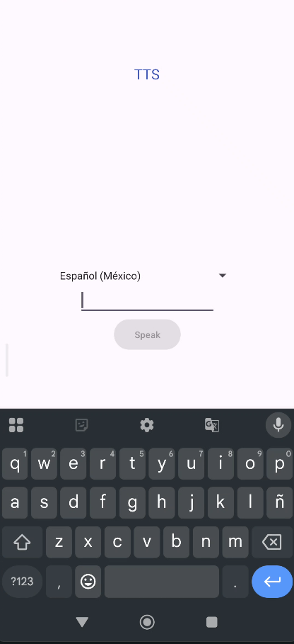
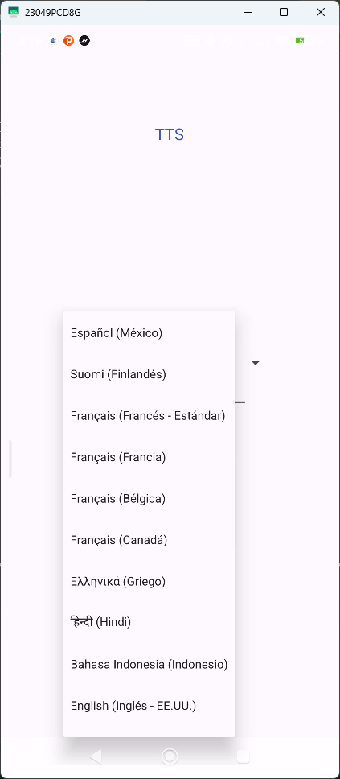

# Text-to-Speech (TTS) para Android

[](https://kotlinlang.org/)
[](https://www.android.com/)
[](https://developer.android.com/about/versions/android-5.0)

Una aplicación de Android que convierte texto a voz (TTS) con soporte para múltiples idiomas y dialectos.

## Características

- ✅ Soporte para más de 50 idiomas y dialectos
- ✅ Interfaz de usuario intuitiva
- ✅ Selección de idioma fácil de usar
- ✅ Funcionalidad sin conexión (dependiendo del motor TTS instalado)
- ✅ Compatible con Android 5.0 (API 21) y superiores

## Idiomas Soportados

La aplicación incluye soporte para una amplia variedad de idiomas, incluyendo:

- **Español** (España, México, Argentina, Colombia)
- **Inglés** (EE.UU., Reino Unido, Australia, India, Canadá)
- **Francés** (Francia, Canadá, Bélgica)
- **Portugués** (Brasil, Portugal)
- **Alemán**
- **Italiano**
- **Japonés**
- **Coreano**
- **Chino** (Mandarín Simplificado, Tradicional, Cantonés)
- **Árabe** (estándar, Egipto, Arabia Saudita)
- **Catalán**
- **Holandés**
- **Ruso**
- **Y muchos más...**

## Requisitos

- Android 5.0 (API 21) o superior
- Motor TTS compatible (como Google Text-to-Speech)
- Conexión a Internet (solo para descargar paquetes de idiomas)

## Instalación

1. Clona este repositorio:
   ```bash
   git clone https://github.com/tuusuario/tts-android.git
   ```
2. Abre el proyecto en Android Studio
3. Sincroniza el proyecto con los archivos de Gradle
4. Conecta un dispositivo Android o inicia un emulador
5. Ejecuta la aplicación

## Uso

1. Escribe o pega el texto que deseas convertir a voz
2. Selecciona el idioma deseado del menú desplegable
3. Toca el botón de reproducción para escuchar el texto

## Permisos

La aplicación requiere los siguientes permisos:

- `INTERNET` - Para descargar paquetes de idiomas
- `ACCESS_NETWORK_STATE` - Para verificar el estado de la conexión
- `RECORD_AUDIO` - Para la salida de audio
- `WAKE_LOCK` - Para mantener el dispositivo despierto durante la reproducción

## Personalización

### Añadir más idiomas

Puedes agregar más idiomas editando el archivo `MainActivity.kt` y añadiendo nuevas entradas al mapa `supportedLocales`:

```kotlin
private val supportedLocales = listOf(
    // ... idiomas existentes ...
    Locale("codigo_idioma", "codigo_pais") to "Nombre del idioma",
    // ...
)
```

## Capturas de Pantalla

| Pantalla Principal | Selección de Idioma |
|-------------------|---------------------|
|  |  |

## Contribución

Las contribuciones son bienvenidas. Por favor, lee las [pautas de contribución](CONTRIBUTING.md) antes de enviar un pull request.

## Licencia

```
Copyright 2023 Javier Adrian 

Licensed under the Apache License, Version 2.0 (the "License");
you may not use this file except in compliance with the License.
You may obtain a copy of the License at

   http://www.apache.org/licenses/LICENSE-2.0

Unless required by applicable law or agreed to in writing, software
distributed under the License is distributed on an "AS IS" BASIS,
WITHOUT WARRANTIES OR CONDITIONS OF ANY KIND, either express or implied.
See the License for the specific language governing permissions and
limitations under the License.

Hecho con ❤️ para la comunidad de Android
